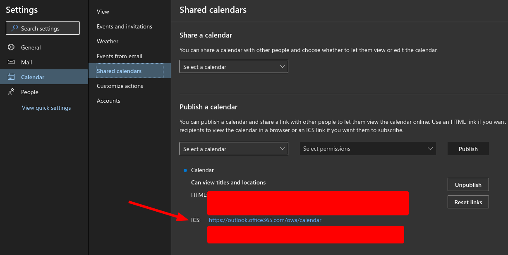
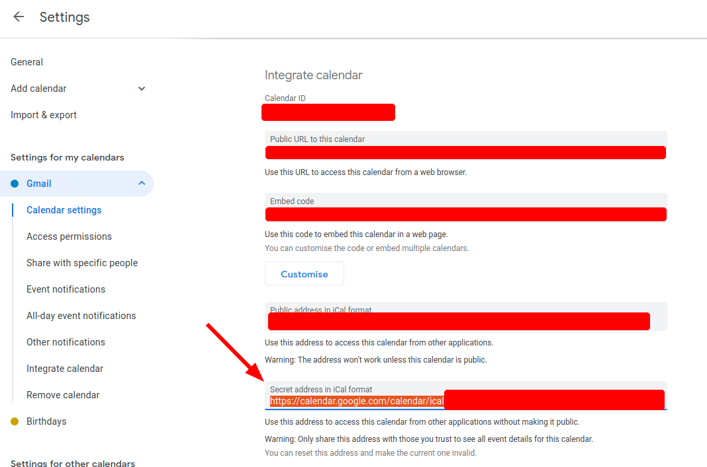

Sometimes you need access to your calendar data, such as when making synchronization tools.
In my particular case, I use my calendar as a high-level time-tracking tool which I then sync with [Clockify](https://clockify.me/) using their API.
To achieve synchronization, I first have to extract the raw event data from my calendar.

## Outlook ICS URL

If you're using Outlook, you can find your ICS URL here:



## Google Calendar ICS URL

If you're using Google Calendar, you can find your ICS URL here:



## Python Code

The following code snippet is an example Python script that connects to your calendar's ICS URL, downloads all the events, and dumps them to a CSV file.
The code may also be found in my [snippets repo](https://github.com/nnadeau/snippets).

The previously obtained ICS URL can either be set as an environment variable (e.g., `export CAL_ICS_URL=<URL>`) or set using the `--url` argument in the CLI.

The following non-standard library packages are required: [`fire`](https://github.com/google/python-fire), [`pandas`](https://pandas.pydata.org/), and [`ics`](https://github.com/C4ptainCrunch/ics.py).

```python
import logging
import os
from datetime import date, datetime
from pathlib import Path
from typing import Optional
from urllib.request import urlopen

import fire
import pandas as pd
from ics import Calendar

CAL_ICS = os.getenv("CAL_ICS_URL")
NOW = datetime.now().strftime("%Y-%m-%d")
DEFAULT_OUTPUT_PATH = Path(__file__).parent / f"{NOW}_calendar.csv"
logger = logging.getLogger(__file__)


def main(output: Optional[str] = None, url: Optional[str] = None):
    # get calendar
    if not url and not CAL_ICS:
        logger.error("URL argument or CAL_ICS_URL env variable must be set")
        quit()
    elif not url:
        url = CAL_ICS

    logger.info("Reading calendar")
    cal = Calendar(urlopen(url).read().decode("iso-8859-1"))

    # get events
    events = [e.__dict__ for e in cal.events]
    logger.info(f"Fetched {len(events)} events")

    # create dataframe
    df = pd.DataFrame(events)

    # dump output
    if not output:
        output = DEFAULT_OUTPUT_PATH.resolve()
    else:
        output = Path(output)
    logger.info(f"Saving to {output.resolve()}")
    df.to_csv(output, index=False)


if __name__ == "__main__":
    logging.basicConfig(level=logging.INFO)
    fire.Fire(main)
```

Since this script is built with the awesome [Python Fire](https://github.com/google/python-fire) library, it can easily be run as a command line tool:

```bash
# default args
python3 download_ical.py

# with args
python3 download_ical.py --output my-output.csv --url https://outlook.office365.com/owa/calendar/abc/xyz/calendar.ics
```
