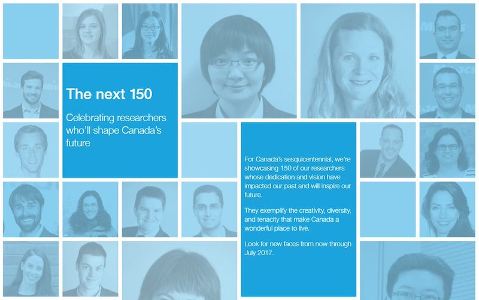

+++
title = "Celebrating researchers who'll shape Canada's future: Nicholas Nadeau"
date = 2017-04-10T00:00:00
tags = ['robots', 'neuroscience']
categories = ["posts"]
+++

>For Canada’s sesquicentennial, we showcased 150 of our researchers whose dedication and vision have impacted our past and will inspire our future.
They exemplify the creativity, diversity, and tenacity that make Canada a wonderful place to live.

via [Mitacs](https://www.mitacs.ca/en/150-for-150#150-nicholas-nadeau)

