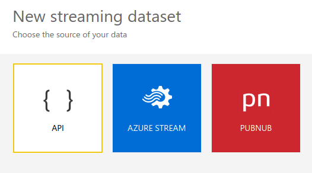
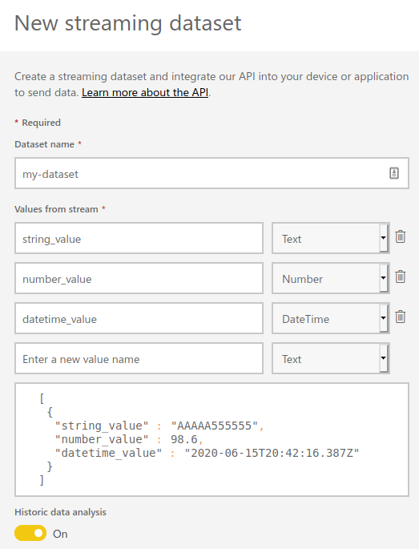

[Power BI](https://powerbi.microsoft.com/) is a business analytics service by Microsoft that aims to provide data visualizations and business intelligence capabilities through simple report and dashboard tools.

One interesting feature is the ability to create [Streaming Datasets](https://docs.microsoft.com/en-us/power-bi/connect-data/service-real-time-streaming) that can receive data through a simple [REST API](https://en.wikipedia.org/wiki/Representational_state_transfer).
With this feature, data can be streamed in real-time to update dashboards.

With just a few lines of Python and the [`requests`](https://requests.readthedocs.io/) package, getting up and running with the Streaming Datasets feature is quick and easy.

## Setting Up a Streaming Dataset

- In [your dashboard view](https://app.powerbi.com/groups/me/list/dashboards), create a new `Streaming dataset`


- Select `API`



- Fill in the desired data structure and value types



- Make sure to activate `Historic data analysis` if you want data to be cached and retained for longer-lasting analytics
- Click `Create` and you're done!

## Get API URL

- In [your dashboard view](https://app.powerbi.com/groups/me/list/dashboards), select your new dataset and click `API Info`


- Copy the provided `Push URL` that will be used in a Python code below


## Python Code to Push Data

The following code will push data to the previously created API.
Each time this script is run, a new data payload is sent to the Power BI dataset.
Integrating this code into an IoT device (e.g., Raspberry Pi sensor) or a cron job can allow for simple data logging and dashboard views.

```python
from datetime import datetime
import requests
import json

# copy "Push URL" from "API Info" in Power BI
url = "https://api.powerbi.com/beta/MY-PUSH-URL-TOKEN"

# timestamps should be formatted like this
now = datetime.strftime(datetime.now(), "%Y-%m-%dT%H:%M:%S")

# data dict must be contained in a list
data = [
  {
    "string_value": "ABC XYZ",
    "number_value": 12345,
    "datetime_value": now}
  ]

# post/push data to the streaming API
headers = {"Content-Type": "application/json"}
response = requests.request(
    method="POST", url=url, headers=headers, data=json.dumps(data)
)
```
