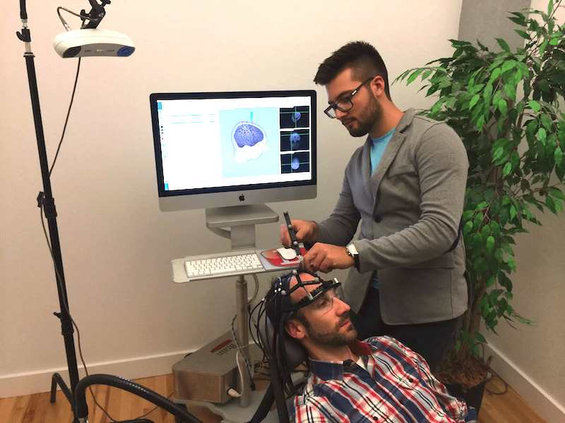

+++
title = "Robotic Arm to Aid with Mental Health Treatment"
date = 2016-05-13T00:00:00
tags = ['robots', 'neuroscience']
categories = ["posts"]
+++

TMS is approved for mental health treatment in Canada and has had promising results treating illnesses such as depression and schizophrenia.

Rogue wanted to explore a robotic solution to complement their existing software and improve the accuracy of TMS treatment.

Nicholas began researching how to develop a robotic arm that could be produced inexpensively and used in clinical settings - features not readily available with existing robotic arms.

Ultimately, Rogue and Nicholas determined that manufacturing a robotic arm in-house would be too expensive, so they're now exploring the project with a local robotics company.

"Now I'm working on a variety of projects with Rogue Research, including a surgical robot for small animals. Accelerate has allowed me to apply my interest in robotics to an industry challenge - now I'm working on several."

Via [Mitacs](https://www.mitacs.ca/en/newsroom/success-story/robotic-arm-aid-mental-health-treatment)